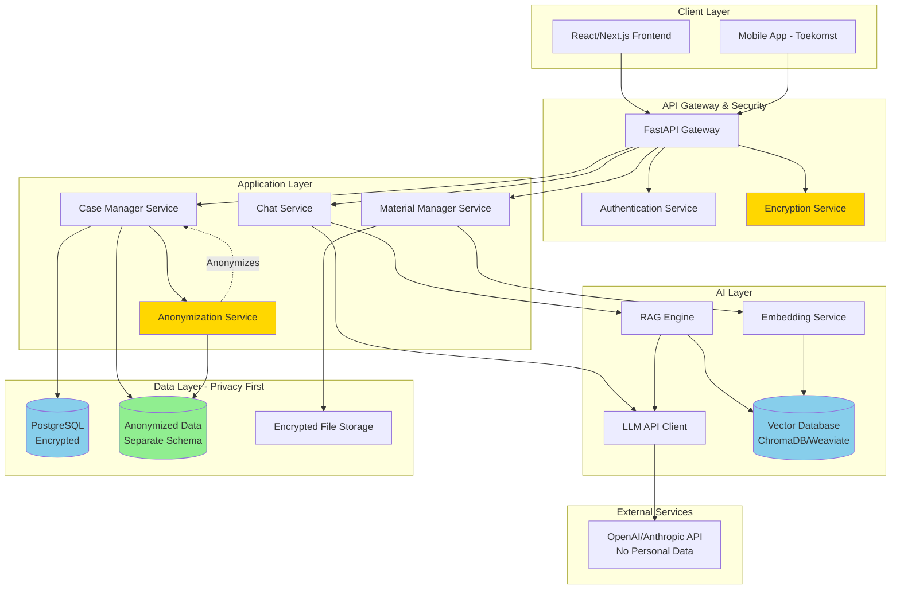
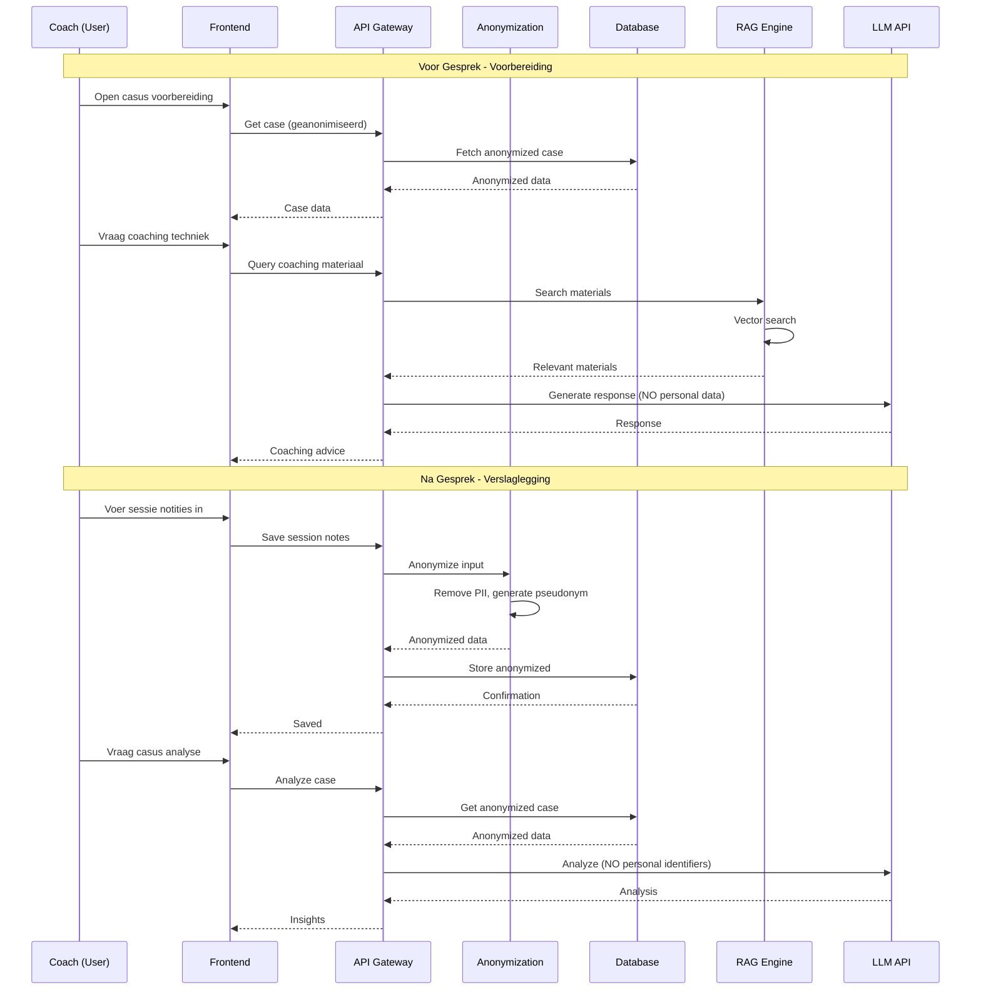
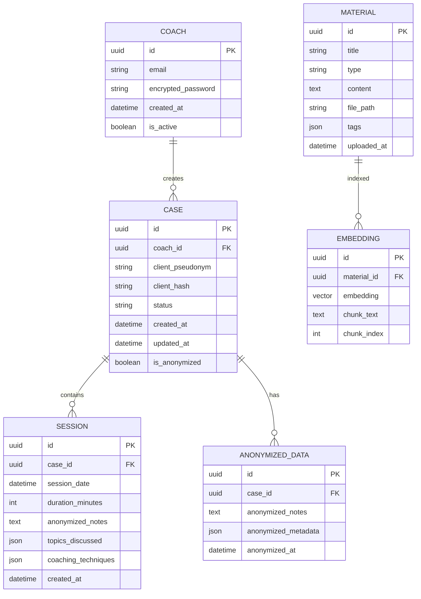
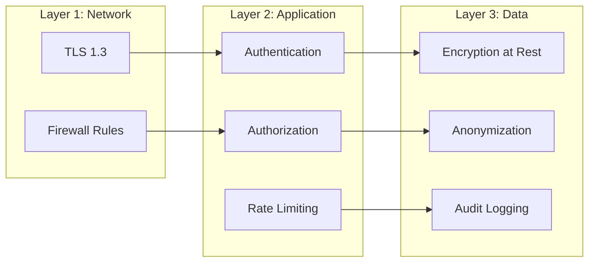
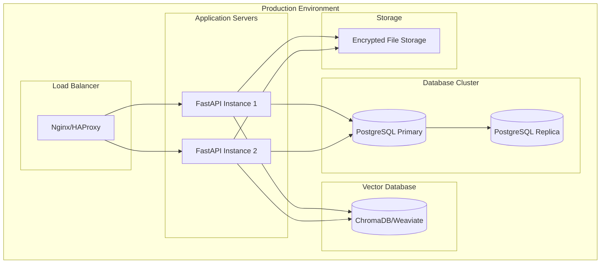

# Technisch Architectuurdiagram - AI Coach Chatbot

## Systeem Overzicht

## Data Flow - Privacy-First

## Privacy-First Data Model

## Component Details

### 1. Anonymization Service
**Verantwoordelijkheid**: Automatische anonimisering van alle persoonsgegevens

**Process**:
1. Input validatie en PII detectie
2. Namen → Pseudoniemen generatie
3. Contactgegevens → Hashing
4. Herkenbare details → Generieke beschrijvingen
5. Validatie van anonimisering niveau

**Technologie**: 
- Python met spaCy/NER voor PII detectie
- Custom anonymization rules
- Hash functions (SHA-256)

### 2. RAG Engine
**Verantwoordelijkheid**: Retrieval van relevante coaching materiaal

**Process**:
1. Query embedding generatie
2. Vector similarity search
3. Top-K document retrieval
4. Context formatting voor LLM
5. Source attribution

**Technologie**:
- LangChain voor RAG pipeline
- ChromaDB of Weaviate voor vector storage
- OpenAI embeddings of open-source alternatief

### 3. Encryption Service
**Verantwoordelijkheid**: End-to-end encryptie van gevoelige data

**Process**:
1. Data encryptie bij opslag (AES-256)
2. Key management
3. Decryptie bij retrieval
4. Encrypted backups

**Technologie**:
- Python cryptography library
- Key derivation (PBKDF2)
- Secure key storage

### 4. Case Manager Service
**Verantwoordelijkheid**: Casusbeheer met privacy-first approach

**Features**:
- Anonieme casus creatie
- Sessie tracking (geanonimiseerd)
- Privacy-compliant queries
- Data export/verwijdering

### 5. Material Manager Service
**Verantwoordelijkheid**: Coaching materiaal beheer

**Features**:
- Document upload (PDF, DOCX, MD)
- Automatische chunking en embedding
- Categorisatie en tagging
- Versiebeheer

## Security Layers

## Deployment Architecture

## Technology Stack

### Backend
- **Framework**: FastAPI (Python)
- **Database**: PostgreSQL 15+ (met encryptie)
- **Vector DB**: ChromaDB (lokaal) of Weaviate
- **ORM**: SQLAlchemy
- **Authentication**: JWT tokens
- **Encryption**: Python cryptography

### AI/ML
- **LLM**: OpenAI GPT-4/3.5 of Anthropic Claude
- **Embeddings**: OpenAI text-embedding-3-small
- **RAG Framework**: LangChain
- **NLP**: spaCy voor PII detectie

### Frontend
- **Framework**: Next.js 14+ (React)
- **UI Library**: Tailwind CSS + shadcn/ui
- **State Management**: Zustand of React Query
- **Forms**: React Hook Form

### Infrastructure
- **Containerization**: Docker
- **Orchestration**: Docker Compose (dev) / Kubernetes (prod)
- **CI/CD**: GitHub Actions
- **Monitoring**: Prometheus + Grafana
- **Logging**: Structured logging (JSON)

## Privacy Compliance Checklist

- [x] Automatische PII detectie en anonimisering
- [x] End-to-end encryptie
- [x] Lokale data opslag (geen externe sharing)
- [x] Audit logging (zonder persoonsgegevens)
- [x] Right to be forgotten implementatie
- [x] Data retention policies
- [x] Transparantie dashboard
- [x] Consent management
- [x] GDPR compliance
- [x] Zero-knowledge LLM queries

