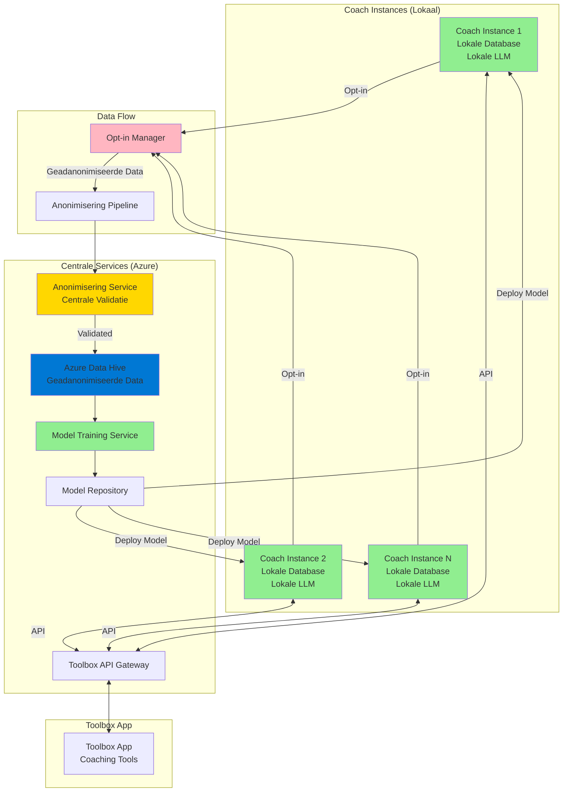
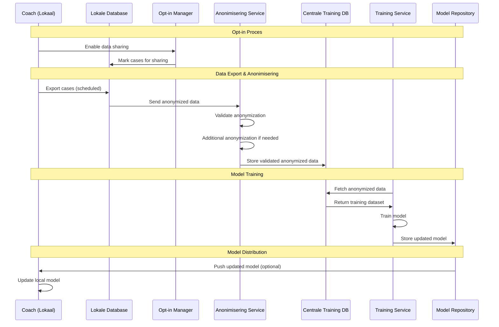

# Federated Learning & Centrale Training Architectuur

## Overzicht

Dit document beschrijft de architectuur voor federated learning en centrale model training waarbij:
1. **Lokale Opslag**: Data blijft lokaal bij coaches (privacy-first)
2. **Lokale AI**: AI draait lokaal bij coaches (geen externe API calls)
3. **Opt-in Sharing**: Coaches kunnen opt-in voor geanonimiseerde data sharing
4. **Centrale Anonimisering**: Centrale service voor anonimisering en validatie
5. **Azure Data Hive**: Centrale opslag van geanonimiseerde data op Azure
6. **Model Training**: Centrale training met geanonimiseerde data van meerdere coaches
7. **Model Deployment**: Getrainde modellen worden lokaal geïnstalleerd bij coaches
8. **Toolbox Integratie**: API voor koppeling met coaching tools

## Architectuur Diagram



## Data Flow - Opt-in & Training



## Componenten

### 1. Opt-in Manager

**Verantwoordelijkheid**: Beheer van coach consent voor data sharing

**Features**:
- Consent management per coach
- Granulaire controle (welke data types)
- Revocatie mogelijkheid
- Transparantie dashboard

**Data Model**:
```python
class DataSharingConsent:
    coach_id: str
    consent_given: bool
    consent_date: datetime
    data_types: List[str]  # cases, sessions, materials
    anonymization_level: str  # full, partial
    revocable: bool
```

### 2. Centrale Anonimisering Service

**Verantwoordelijkheid**: Validatie en extra anonimisering van gedeelde data

**Process**:
1. Ontvang geanonimiseerde data van coaches
2. Valideer anonimisering niveau
3. Extra anonimisering indien nodig
4. Kwaliteitscontrole
5. Opslag in training database

**Validatie Regels**:
- Geen PII detectie
- Pseudoniemen consistent
- Geen herleidbare informatie
- K-anonymity check

### 3. Model Training Service

**Verantwoordelijkheid**: Centrale training met geanonimiseerde data

**Features**:
- Batch training op geanonimiseerde datasets
- Incremental learning
- Model versioning
- A/B testing van modellen
- Performance tracking

**Training Pipeline**:
1. Data preprocessing (extra anonimisering check)
2. Feature extraction
3. Model training (LoRA fine-tuning)
4. Validation
5. Model deployment

### 4. Toolbox API Gateway

**Verantwoordelijkheid**: Integratie met Toolbox app

**Endpoints**:
- `/api/toolbox/tools` - Lijst beschikbare tools
- `/api/toolbox/import` - Import tool data
- `/api/toolbox/export` - Export coaching data
- `/api/toolbox/sync` - Synchronisatie

## Privacy & Security

### Anonimisering Niveaus

1. **Level 1 - Basis** (lokaal):
   - Namen → Pseudoniemen
   - Contactgegevens → Hashes
   - Directe PII verwijdering

2. **Level 2 - Centraal** (voor training):
   - Extra validatie
   - K-anonymity enforcement
   - Differential privacy technieken
   - Contextual anonymization

### Data Minimization

- Alleen relevante data voor training
- Geen volledige casusgeschiedenis
- Alleen patterns en structuren
- Geen unieke identifiers

### Consent Management

```python
class ConsentFlow:
    def request_consent(self, coach_id: str) -> ConsentRequest:
        """Request consent for data sharing"""
        pass
    
    def grant_consent(self, consent_id: str, data_types: List[str]):
        """Grant consent with specific data types"""
        pass
    
    def revoke_consent(self, consent_id: str):
        """Revoke consent and delete shared data"""
        pass
    
    def get_consent_status(self, coach_id: str) -> ConsentStatus:
        """Get current consent status"""
        pass
```

## Model Training Pipeline

### Training Data Structuur

```json
{
  "training_id": "uuid",
  "coach_id": "hashed",
  "data_type": "case_patterns|session_patterns|techniques",
  "anonymized_content": {
    "patterns": ["pattern1", "pattern2"],
    "techniques_used": ["technique1", "technique2"],
    "outcomes": "generic_outcome",
    "metadata": {
      "session_count": 5,
      "duration_avg": 60,
      "anonymization_level": "full"
    }
  },
  "anonymized_at": "datetime",
  "validated": true
}
```

### Training Process

1. **Data Collection** (opt-in coaches):
   - Scheduled export van geanonimiseerde data
   - Validatie door centrale service
   - Opslag in training database

2. **Data Preparation**:
   - Deduplicatie
   - Quality checks
   - Feature extraction
   - Dataset splitting

3. **Model Training**:
   - Base model: Llama 3 / Mistral
   - Fine-tuning: LoRA
   - Training op geanonimiseerde patterns
   - Validation en testing

4. **Model Deployment**:
   - Version control
   - A/B testing
   - Gradual rollout
   - Performance monitoring

## Toolbox Integratie

### API Endpoints

#### 1. Tool Synchronisatie
```python
POST /api/toolbox/sync
{
  "tool_id": "uuid",
  "tool_data": {...},
  "coach_id": "uuid"
}
```

#### 2. Data Export naar Toolbox
```python
GET /api/toolbox/export
{
  "coach_id": "uuid",
  "data_types": ["cases", "sessions"],
  "format": "json"
}
```

#### 3. Tool Import van Toolbox
```python
POST /api/toolbox/import
{
  "tool_id": "uuid",
  "tool_data": {...},
  "coach_id": "uuid"
}
```

### Data Mapping

```python
class ToolboxMapper:
    def map_case_to_tool(self, case: Case) -> ToolboxCase:
        """Map case data to Toolbox format"""
        pass
    
    def map_tool_to_case(self, tool_data: dict) -> Case:
        """Map Toolbox data to case format"""
        pass
```

## Implementatie Roadmap

### Fase 1: Opt-in & Anonimisering
- [ ] Opt-in UI component
- [ ] Consent management API
- [ ] Centrale anonimisering service
- [ ] Data export pipeline

### Fase 2: Training Infrastructure
- [ ] Training data database
- [ ] Model training service
- [ ] Model versioning
- [ ] Deployment pipeline

### Fase 3: Toolbox Integratie
- [ ] Toolbox API gateway
- [ ] Data mapping service
- [ ] Synchronisatie mechanisme
- [ ] Import/export functionaliteit

### Fase 4: Advanced Features
- [ ] Federated learning (optioneel)
- [ ] Differential privacy
- [ ] Advanced anonymization
- [ ] Real-time model updates

## Security Considerations

1. **Encryption**: All data in transit encrypted (TLS 1.3)
2. **Access Control**: Role-based access to training data
3. **Audit Logging**: All data access logged
4. **Data Retention**: Automatic deletion after training
5. **Anonymization Validation**: Multiple validation layers

## Compliance

- **GDPR**: Full compliance with opt-in consent
- **Right to be Forgotten**: Data deletion on request
- **Data Portability**: Export functionality
- **Transparency**: Clear documentation of data usage

