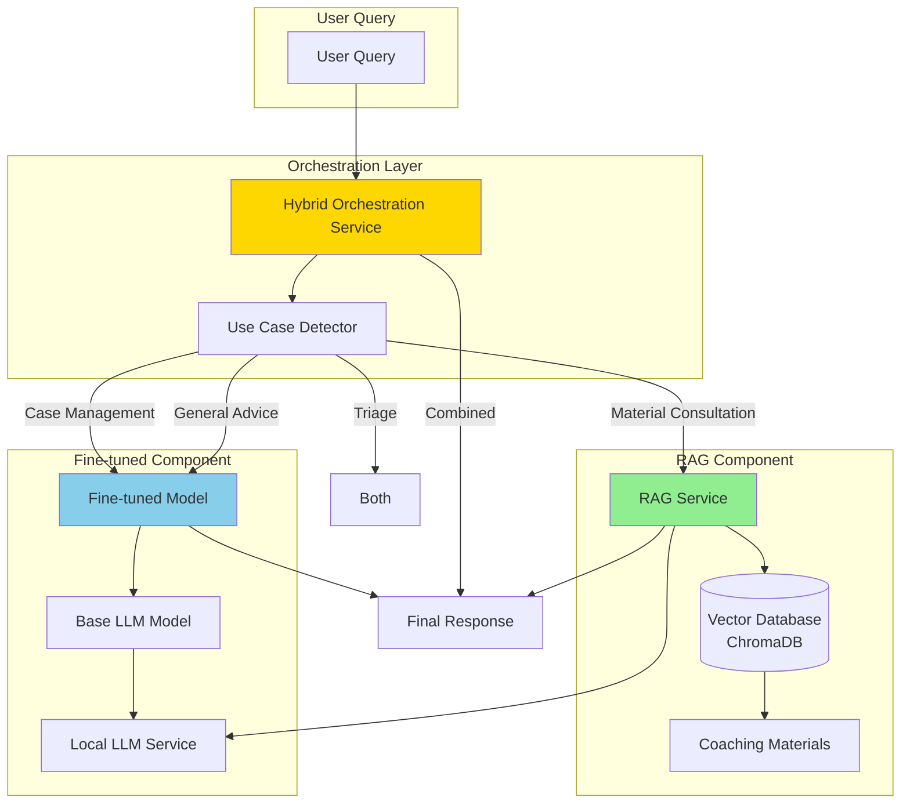

# Hybride Systeem Implementatie (Optie 3)

## Overzicht

Dit document beschrijft de implementatie van het hybride systeem (Optie 3) dat combineert:
1. **RAG Component** - Voor coaching materiaal retrieval
2. **Fine-tuned Component** - Voor coaching-specifieke responses
3. **Orchestration Layer** - Beslist wanneer welke component te gebruiken

## Architectuur



## Use Cases & Component Selectie

### 1. Material Consultation → RAG Only
**Wanneer**: Vragen over coaching technieken, methodologieën, tools
**Component**: RAG
**Reden**: Flexibele retrieval van coaching materiaal

**Voorbeelden**:
- "Wat zijn goede coaching technieken voor stress?"
- "Hoe werkt de GROW methodiek?"
- "Welke oefeningen zijn geschikt voor team coaching?"

### 2. Case Management → Fine-tuned Model
**Wanneer**: Casus analyse, gestructureerde data entry, casus-specifieke adviezen
**Component**: Fine-tuned model
**Reden**: Domain expertise voor coaching taal en casus begrip

**Voorbeelden**:
- "Analyseer deze casus en geef advies"
- "Wat zijn de belangrijkste issues in deze casus?"
- "Geef een gestructureerd overzicht van deze cliënt"

### 3. Triage → Both (Fine-tuned Priority)
**Wanneer**: Triage van casussen, prioriteitsbepaling
**Component**: Beide (fine-tuned heeft prioriteit)
**Reden**: Fine-tuned voor triage logica, RAG voor relevante methodologieën

**Voorbeelden**:
- "Triage deze casus"
- "Wat is de prioriteit van deze situatie?"
- "Welke coaching type past hierbij?"

### 4. Combined Advisory → Both (Balanced)
**Wanneer**: Algemene coaching vragen zonder specifieke use case
**Component**: Beide (balanced)
**Reden**: Beste van beide werelden

**Voorbeelden**:
- "Hoe kan ik een cliënt helpen met werkstress?"
- "Wat zijn goede vragen voor een intake gesprek?"

## Implementatie Details

### Orchestration Service

```python
from app.services.orchestration import hybrid_orchestration_service

# Automatische use case detectie
response = hybrid_orchestration_service.generate_response(
    query="Wat zijn goede coaching technieken?",
    context=None
)

# Expliciete use case
response = hybrid_orchestration_service.generate_response(
    query="Analyseer deze casus",
    context={"case_id": "123"},
    use_case=UseCase.CASE_MANAGEMENT
)
```

### RAG Component

- **Vector Database**: ChromaDB
- **Embeddings**: Lokale embeddings (HuggingFace) of OpenAI
- **Retrieval**: Top-K similarity search
- **Context**: Coaching materiaal alleen

### Fine-tuned Component

- **Base Model**: Mistral 7B / Llama 3
- **Fine-tuning**: LoRA adapters
- **Training Data**: Geanonimiseerde coaching data uit Azure Data Hive
- **Deployment**: Lokaal via Ollama/vLLM

## Data Flow

### Material Consultation Flow

```
User Query → Orchestration → Use Case: MATERIAL_CONSULTATION
→ RAG Service → Vector Search → Retrieve Materials
→ Local LLM (with context) → Response
```

### Case Management Flow

```
User Query → Orchestration → Use Case: CASE_MANAGEMENT
→ Fine-tuned Model → Coaching-specific prompt
→ Local LLM (fine-tuned) → Response
```

### Combined Flow

```
User Query → Orchestration → Use Case: COMBINED_ADVISORY
→ Parallel:
  ├─ RAG Service → Material context
  └─ Fine-tuned Model → Coaching advice
→ Combine responses → Final response
```

## Fine-tuning Pipeline

### 1. Data Collection
- Geanonimiseerde casussen uit Azure Data Hive
- Coaching materiaal patterns
- Triage voorbeelden

### 2. Training
- Base model: Mistral 7B
- LoRA fine-tuning
- Training op coaching-specifieke patterns

### 3. Deployment
- Model opslag in Azure Data Hive
- Deployment naar lokale instances
- Version control

### 4. Integration
- Model loading in orchestration service
- Fallback naar base model indien nodig
- Health checks

## Voordelen van Hybride Systeem

### Flexibiliteit
- ✅ Nieuwe coaching materiaal zonder hertraining
- ✅ RAG voor up-to-date informatie
- ✅ Fine-tuned voor consistente coaching taal

### Performance
- ✅ RAG voor specifieke materiaal vragen (sneller)
- ✅ Fine-tuned voor casus analyse (betere kwaliteit)
- ✅ Gecombineerd voor beste resultaten

### Kosten
- ✅ Lokale deployment (geen API costs)
- ✅ LoRA fine-tuning (efficiënt)
- ✅ Schaalbaar met Azure Data Hive

## Status Monitoring

```python
status = hybrid_orchestration_service.get_system_status()
# Returns:
# {
#   "rag_available": True,
#   "fine_tuned_model_available": False,
#   "local_llm_available": True,
#   "method": "hybrid_system"
# }
```

## Roadmap

### Fase 1: MVP (Huidig)
- ✅ RAG component geïmplementeerd
- ✅ Orchestration layer geïmplementeerd
- ✅ Base model integratie
- ⏳ Fine-tuned model training

### Fase 2: Fine-tuning
- [ ] Training data verzameling
- [ ] LoRA fine-tuning pipeline
- [ ] Model deployment
- [ ] Performance validatie

### Fase 3: Optimalisatie
- [ ] Use case detectie verbetering
- [ ] Response combinatie optimalisatie
- [ ] Caching strategie
- [ ] Performance monitoring

## Gebruik

### In Chat API

```python
# Automatische orchestratie
response = hybrid_orchestration_service.generate_response(
    query=user_query,
    context={"case_id": case_id}
)
```

### In Triage Service

```python
# Triage gebruikt beide componenten
assessment = hybrid_orchestration_service.generate_response(
    query=triage_query,
    use_case=UseCase.TRIAGE
)
```

### In Case Management

```python
# Case management gebruikt fine-tuned model
advice = hybrid_orchestration_service.generate_response(
    query=case_query,
    use_case=UseCase.CASE_MANAGEMENT
)
```

## Conclusie

Het hybride systeem (Optie 3) combineert de beste aspecten van RAG en fine-tuning:
- **RAG** voor flexibele materiaal consultatie
- **Fine-tuned** voor coaching-specifieke expertise
- **Orchestration** voor optimale component selectie

Dit biedt de beste balans tussen flexibiliteit, performance en kosten.


