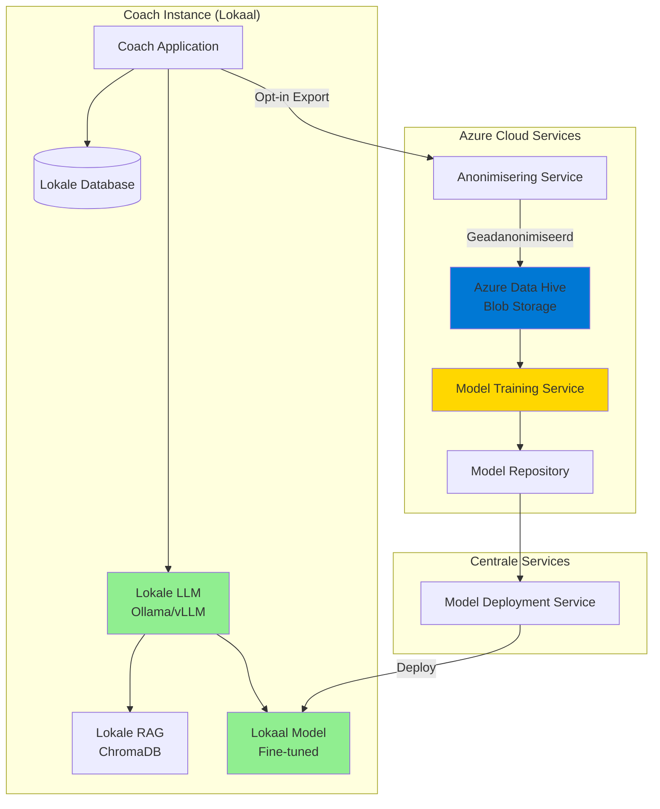
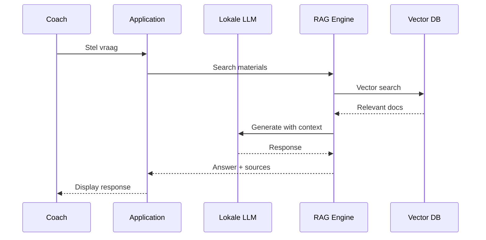
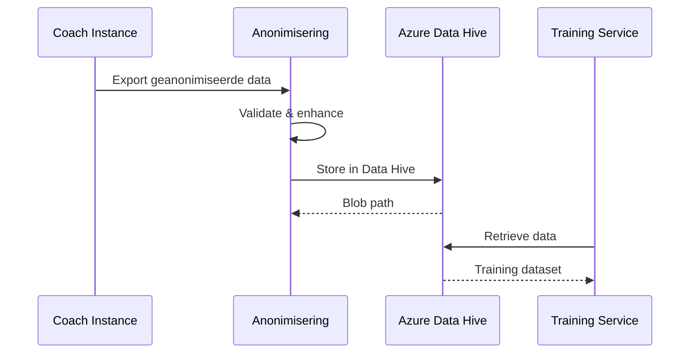
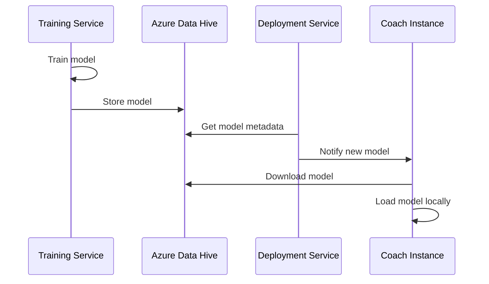

# Lokale AI & Azure Data Hive Architectuur

## Overzicht

Dit document beschrijft de architectuur waarbij:
1. **Lokale AI**: AI draait volledig lokaal bij coaches (geen externe API calls)
2. **Azure Data Hive**: Centrale opslag van geanonimiseerde data op Azure
3. **Model Deployment**: Getrainde modellen worden lokaal geïnstalleerd

## Architectuur Diagram



## Lokale AI Deployment

### Ondersteunde Backends

1. **Ollama** (Aanbevolen voor MVP)
   - Eenvoudig te installeren
   - Ondersteunt veel modellen (Mistral, Llama, etc.)
   - Goede performance

2. **vLLM**
   - Snellere inference
   - Betere voor productie
   - Vereist meer resources

3. **Transformers** (Direct)
   - Volledige controle
   - Geen extra service nodig
   - Vereist meer geheugen

### Setup Instructies

#### Ollama Setup

```bash
# Install Ollama
curl -fsSL https://ollama.ai/install.sh | sh

# Pull model
ollama pull mistral:7b

# Start Ollama service
ollama serve
```

#### Environment Variabelen

```bash
LOCAL_LLM_BACKEND=ollama
OLLAMA_BASE_URL=http://localhost:11434
OLLAMA_MODEL=mistral:7b
USE_LOCAL_EMBEDDINGS=true
```

## Azure Data Hive Setup

### Azure Storage Account

1. **Create Storage Account**
   ```bash
   az storage account create \
     --name coachaidatahive \
     --resource-group coach-ai-rg \
     --location westeurope \
     --sku Standard_LRS
   ```

2. **Create Container**
   ```bash
   az storage container create \
     --name coach-ai-datahive \
     --account-name coachaidatahive
   ```

3. **Get Connection String**
   ```bash
   az storage account show-connection-string \
     --name coachaidatahive \
     --resource-group coach-ai-rg
   ```

### Environment Variabelen

```bash
AZURE_STORAGE_CONNECTION_STRING="DefaultEndpointsProtocol=https;AccountName=..."
AZURE_DATA_HIVE_CONTAINER=coach-ai-datahive
```

## Data Flow

### 1. Lokale AI Gebruik



### 2. Data Export naar Azure



### 3. Model Deployment



## Implementatie Details

### Lokale LLM Service

```python
from app.services.local_llm import get_local_llm_service

# Get service
llm = get_local_llm_service()

# Generate response
response = llm.generate(
    prompt="Wat zijn goede coaching technieken?",
    max_tokens=512,
    temperature=0.7
)
```

### Azure Data Hive Service

```python
from app.services.azure_data_hive import get_azure_data_hive_service

# Get service
hive = get_azure_data_hive_service()

# Store data
blob_name = hive.store_training_data(
    data=anonymized_data,
    metadata={"coach_id_hash": "..."}
)

# Retrieve data
training_data = hive.retrieve_training_data()
```

## Security & Privacy

### Lokale AI
- ✅ Geen data naar externe API's
- ✅ Volledige controle over data
- ✅ Offline mogelijk (na eerste setup)
- ✅ Geen API costs

### Azure Data Hive
- ✅ Encrypted at rest
- ✅ Access control via Azure RBAC
- ✅ Audit logging
- ✅ GDPR compliant storage

## Performance Overwegingen

### Lokale LLM Requirements

**Minimum (Ollama + Mistral 7B)**:
- CPU: 8 cores
- RAM: 16GB
- Storage: 10GB (voor model)

**Aanbevolen (vLLM + Mistral 7B)**:
- CPU: 16 cores
- RAM: 32GB
- GPU: NVIDIA GPU (optioneel, maar aanbevolen)
- Storage: 20GB

### Azure Data Hive

- Standard storage tier voor development
- Premium tier voor productie (betere performance)
- Lifecycle management voor oude data

## Monitoring

### Lokale LLM Health

```python
# Health check
llm = get_local_llm_service()
is_healthy = llm.health_check()

# Model info
info = llm.get_model_info()
```

### Azure Data Hive Statistics

```python
hive = get_azure_data_hive_service()
stats = hive.get_data_statistics()
# Returns: total_blobs, training_data_blobs, model_blobs, total_size
```

## Troubleshooting

### Lokale LLM niet beschikbaar

1. Check Ollama service: `ollama list`
2. Check port: `curl http://localhost:11434/api/tags`
3. Check logs: `journalctl -u ollama`

### Azure Data Hive connectie problemen

1. Verify connection string
2. Check Azure storage account status
3. Verify container exists
4. Check network connectivity

## Kosten Overwegingen

### Lokale AI
- **Hardware**: Eenmalige investering
- **Electriciteit**: ~€5-20/maand (afhankelijk van gebruik)
- **Geen API costs**: Volledig gratis na setup

### Azure Data Hive
- **Storage**: ~€0.018/GB/maand (Standard)
- **Transactions**: ~€0.004 per 10,000
- **Data transfer**: Eerste 5GB gratis, daarna ~€0.08/GB

## Volgende Stappen

1. Setup Ollama lokaal
2. Configure Azure Storage Account
3. Test lokale LLM integratie
4. Test Azure Data Hive upload/download
5. Implementeer model deployment pipeline


